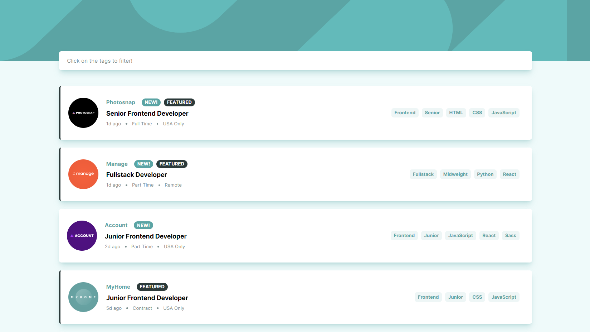
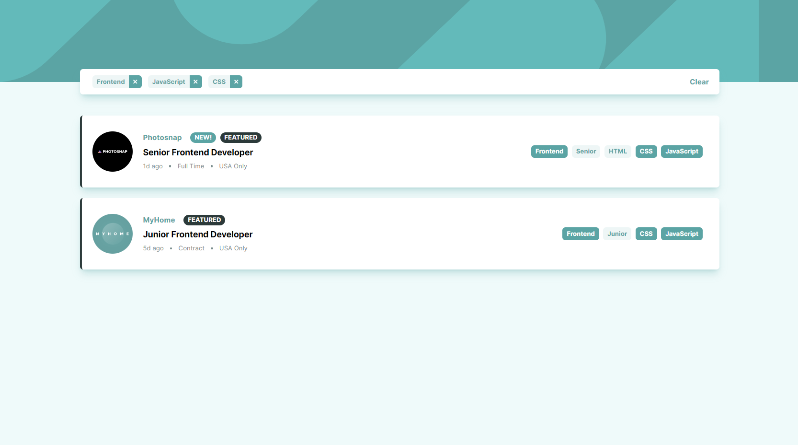
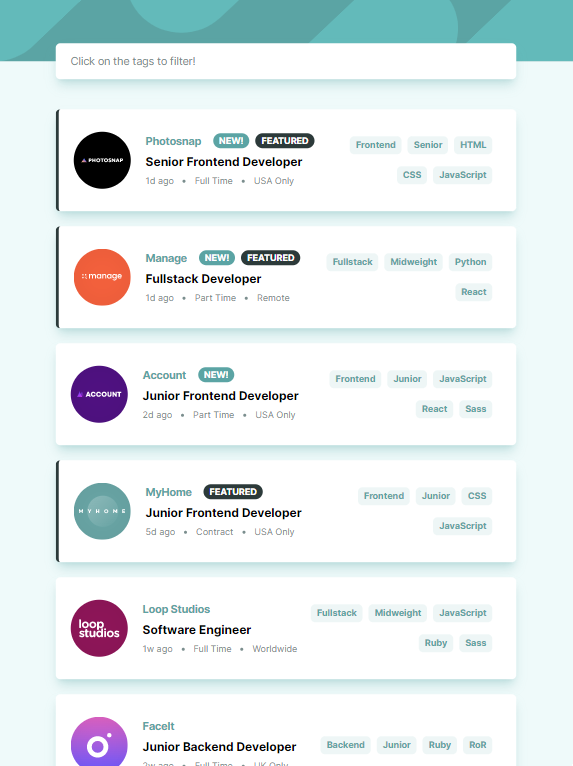
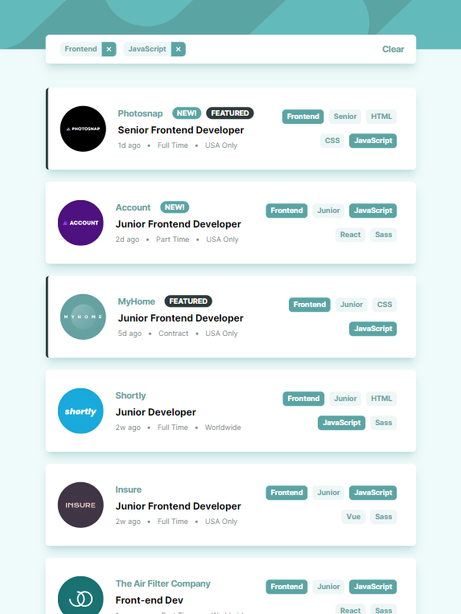
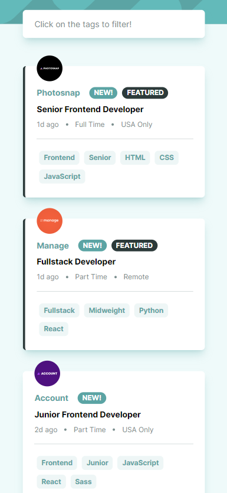
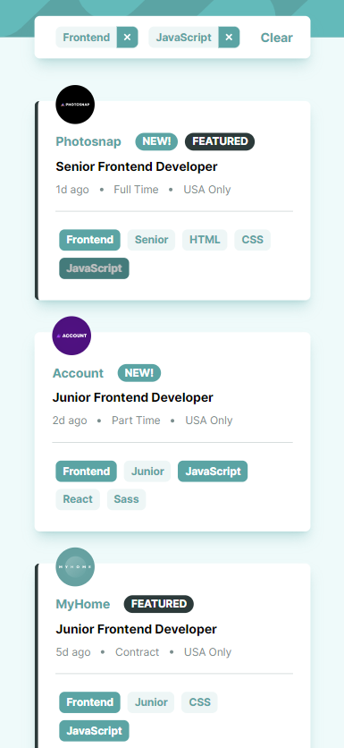

# Job Listings Project

## Overview

This project displays job listings. Each job item shows the company name and logo, the job role, level, technologies and tools required for this role. It also shows how long ago the job was posted.
It allows the user to filter the job listings by clicking on tags. The user can also clear all the filters by clicking "clear" on the FilterBar (which is only visible when some filter is selected). The user can also remove a specific filter by either clicking on "remove" button in the FilterBar, or by clicking on the tag again.

## Technologies

This project was built using the following technologies:

-  React
-  TypeScript
-  Vite
-  Tailwind CSS

## Getting Started

To get started, clone this repository and run the following command:

`yarn install` - this will install all the required dependencies.

`yarn dev` - this will start the app in development mode.

## Data Source

The job listings data is coming from a local JSON file located at /src/services/data.json.

## Responsiveness

The app is responsive and works on mobile, tablet and desktop.

### Desktop

Filtering:

### iPad/Tablet

Filtering:

### Mobile

Filtering:

